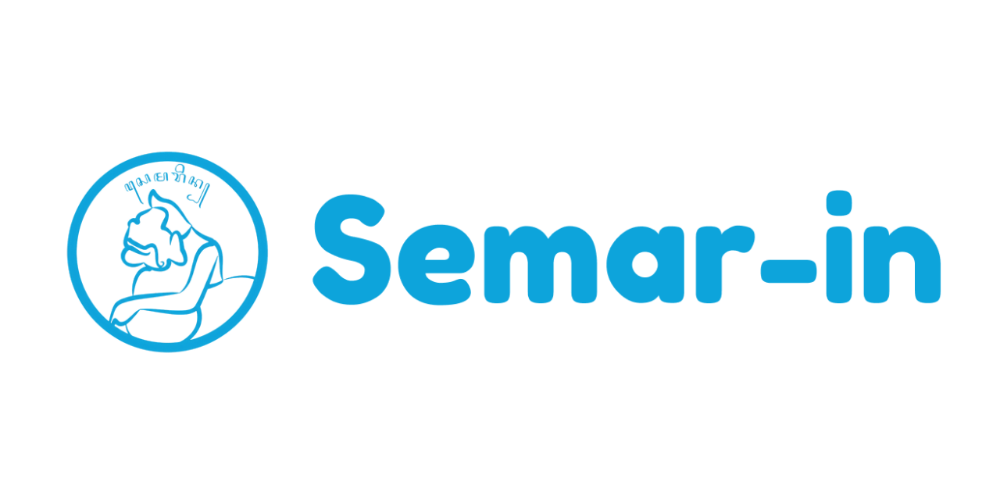

<div align="center">

<!-- ============================================================ -->
<!--                        BANNER IMAGE                         -->
<!-- ============================================================ -->



<br/>

# Semar-In
### *Food Delivery & On-Demand Service Platform*
#### *For the Sivitas Akademika Universitas Sebelas Maret*

<br/>

<!-- ============================================================ -->
<!--                      TECH BADGES                            -->
<!-- ============================================================ -->


-green?style=for-the-badge&logo=android&logoColor=white)


</div>

---

## 📖 About The Project

> *"Satu platform, segala kebutuhan kampus."*

Campus life is fast-paced. Between lectures, assignments, and extracurricular activities, students and academic staff need services that keep up with them — not slow them down. **Semar-In** was born from that very need.

Developed as a digital solution tailored for the **Universitas Sebelas Maret (UNS)** community, Semar-In integrates ride-hailing, food delivery, and errand services into a single, cohesive platform. Say goodbye to fragmented manual processes and hello to a seamless, real-time experience — right from your pocket.

This platform bridges **customers**, **drivers**, and **administrators** with a clean, modern interface and a robust backend, designed not just for today's campus needs, but built to be **flexible enough for future services too**.

<br/>

---

## ✨ Core Services

<br/>

<div align="center">

| | Service | Description |
|---|---|---|
| 🛵 | **Anter-In** | Campus ride-hailing & transportation. Get a quick, safe, and affordable ride across the UNS campus area — on demand, anytime. |
| 🍔 | **Jajan-In** | Food delivery from your favorite campus eateries. Browse menus, order, and track your meal in real time. No more walking in the rain! |
| 📦 | **Titip-In** | Goods delivery & errand service. Need something picked up, dropped off, or taken care of? Our drivers have you covered. |

</div>

<br/>

---

## 📱 Apps

This project ships as **two separate Android applications** sharing a common `:core` module:

| App | Description |
|---|---|
| **Semar-In** (Customer) | The main customer-facing app for ordering services. |
| **Semar-In Driver** | The driver companion app for managing and fulfilling orders in real time. |

<br/>

---

## 🛠️ Tech Stack

<br/>

| Layer | Technology | Role |
|---|---|---|
| **Language** | Kotlin 2.3.21 | 100% Kotlin — modern, concise, and safe |
| **UI Framework** | Jetpack Compose + Material Design 3 | Fully declarative, beautiful native UI |
| **Backend & Auth** | Supabase (PostgreSQL + Auth + Realtime) | Database, authentication, and live order updates |
| **Routing & Maps** | OSRM API *(Open Source Routing Machine)* | Real-time routing, distance, and navigation calculation |
| **Dependency Injection** | Koin | Lightweight and idiomatic DI for Kotlin |
| **Navigation** | Jetpack Navigation Compose 2.9.0 | In-app navigation between screens |
| **Architecture** | Multi-module (`:app-customer`, `:app-driver`, `:core`) | Scalable, separation-of-concerns project structure |

<br/>

---

## 👥 The Team

<div align="center">
  <h2>Tim Kami</h2>
  <table>
    <tr>
      <td align="center">
        <a href="https://github.com/ApriliiaWulandari">
          <br />
          <b>@ApriliiaWulandari</b>
        </a>
      </td>
      <td align="center">
        <a href="https://github.com/BaihaqiHakimAbdullah">
          <br />
          <b>@BaihaqiHakimAbdullah</b>
        </a>
      </td>
      <td align="center">
        <a href="https://github.com/BenedithJeffiersonTanujaya">
          <br />
          <b>@BenedithJeffiersonTanujaya</b>
        </a>
      </td>
      <td align="center">
        <a href="https://github.com/ErikaNurAmalia">
          <br />
          <b>@ErikaNurAmalia</b>
        </a>
      </td>
    </tr>
  </table>
</div>
---

## 🚀 Getting Started

### Prerequisites

- **Android Studio** Meerkat (2024.3+) or later
- **JDK 11** or higher
- **Android device or emulator** running API 24 (Android 7.0) or higher

### Setup

1. **Clone the repository**
```bash
   git clone [https://github.com/your-org/SemarinAndroidApp.git](https://github.com/your-org/SemarinAndroidApp.git)
   cd SemarinAndroidApp

2. **Configure environment variables**

   Create a `local.properties` file in the project root (if it doesn't exist) and add your Supabase credentials:
   ```properties
   SUPABASE_URL=your_supabase_project_url
   SUPABASE_KEY=your_supabase_anon_key
   ```

3. **Open in Android Studio**

   Open the project and let Gradle sync. Once synced, select the build variant you want to run:
   - `app-customer` → for the **Semar-In** customer app
   - `app-driver` → for the **Semar-In Driver** app

4. **Run the app** ▶️

   Select your target device and hit **Run**!

<br/>

---

## 📚 Documentation & Resources

Need a walkthrough? Explore the user manuals and presentation materials below.

### 📘 User Manuals

- **SEMAR-IN User Manual (Customer App)**  
  https://heyzine.com/flip-book/6e946ef2be.html

- **SEMAR-IN for DRIVER User Manual**  
  https://heyzine.com/flip-book/742403bae7.html

### 🎥 Video Presentation

Watch the full project presentation here:

- **YouTube Presentation**  
  https://youtu.be/O53BOQX-z98

<br/>

---

## 📄 License

```text
MIT License

Copyright (c) 2026 Semar-In Team — Universitas Sebelas Maret

Permission is hereby granted, free of charge, to any person obtaining a copy
of this software and associated documentation files (the "Software"), to deal
in the Software without restriction, including without limitation the rights
to use, copy, modify, merge, publish, distribute, sublicense, and/or sell
copies of the Software, subject to the following conditions:

The above copyright notice and this permission notice shall be included in all
copies or substantial portions of the Software.

THE SOFTWARE IS PROVIDED "AS IS", WITHOUT WARRANTY OF ANY KIND, EXPRESS OR
IMPLIED, INCLUDING BUT NOT LIMITED TO THE WARRANTIES OF MERCHANTABILITY,
FITNESS FOR A PARTICULAR PURPOSE AND NONINFRINGEMENT.
````

<br/>

---

<div align="center">

Made with ❤️ for **Sivitas Akademika UNS**

*Semar-In — Satu Platform, Segala Kebutuhan Kampus.*

</div>
```

